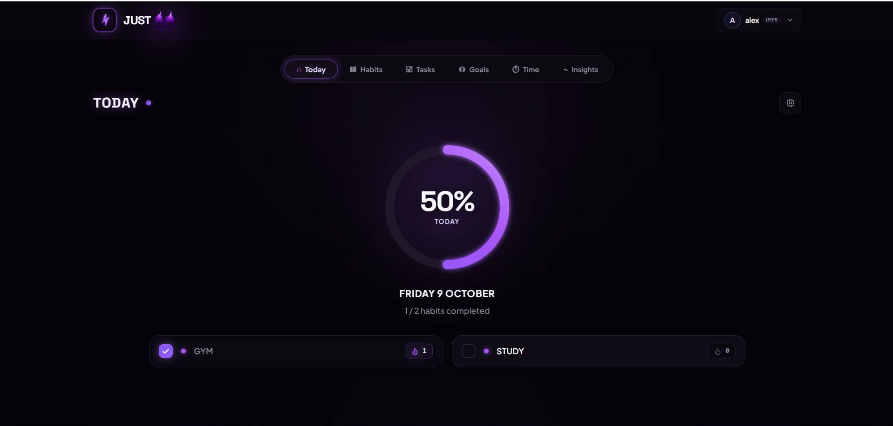
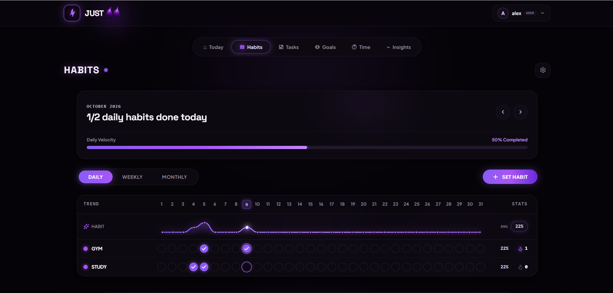
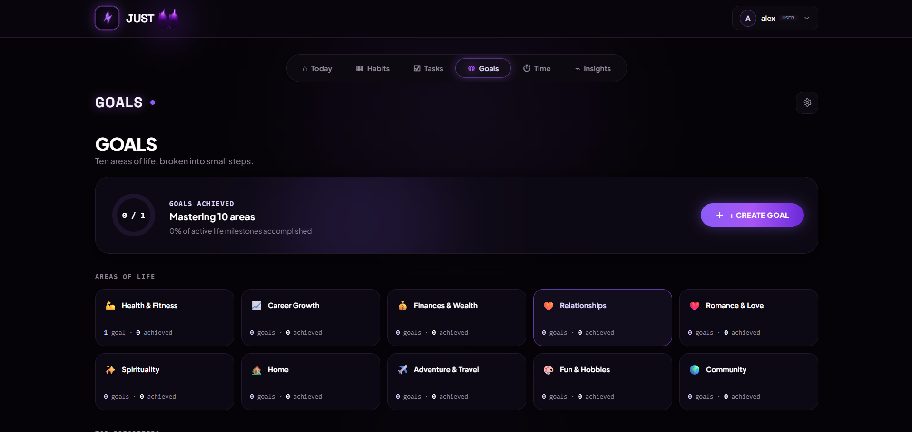
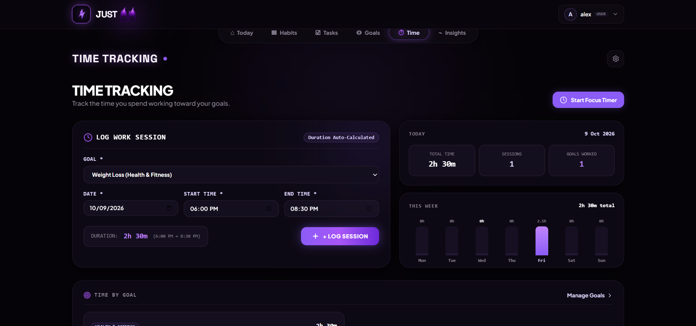
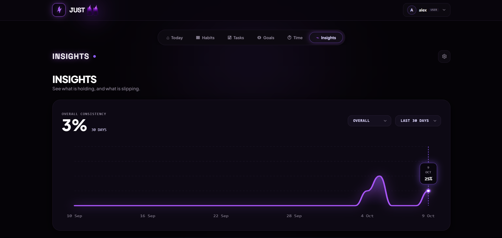

# ChronosGoal

ChronosGoal is a goal-setting and time-management web application. It keeps the existing React interface and connects its authentication, goal, time-tracking, and administrator workflows to a Java 17 Servlet backend using JDBC and MySQL.

## Problem statement

People need a consistent way to turn personal objectives into measurable targets, record effort over time, and understand whether they are making progress. ChronosGoal provides personal goal, task, habit, and time-tracking workflows, while administrators configure goal parameters, manage accounts, and review usage.

## Features

- User registration and session-based login with BCrypt password hashes.
- Create, update, and delete personal goals with targets, categories, priorities, and deadlines.
- Record, edit, and delete goal-linked time sessions.
- Calculate goal progress from database time logs; database triggers maintain totals and completion status.
- Persist personal tasks and habits, including per-day habit history, in MySQL.
- View session-scoped consistency, streak, and tracked-time insights.
- Administrator goal-parameter management, user status/password management, usage reports, and an audit trail.
- Role checks on administrator endpoints and prepared SQL statements for database operations.

## Technology stack

- **Frontend:** React, TypeScript, Vite
- **Backend:** Java 17, Jakarta Servlet 6, Apache Tomcat 10.1
- **Persistence:** JDBC and MySQL 8
- **Security and serialization:** BCrypt password hashing, server-side HTTP sessions, Jackson JSON handling
- **Testing:** JUnit 5 and Mockito

## Project structure

```text
backend/
  src/main/java/com/disciplineos/
    config/       JDBC connection configuration
    dao/          Prepared-statement database access
    filter/       Session and API error filters
    service/      Validation, progress, insights, and concurrent admin reports
    servlet/      Authentication, goal, task, habit, time-log, insight, and admin endpoints
  src/main/resources/db/schema.sql
src/
  components/     Existing React interface
  services/       Frontend API clients and local demo storage
server.ts         Frontend development server and Java API proxy
```

## Requirements

- JDK 17
- Maven 3.9+
- MySQL 8.0+
- Apache Tomcat 10.1+ (Jakarta Servlet 6)
- Node.js 20.19+ and npm

## Database setup

Start MySQL before configuring the application database.

### Option 1: MySQL Workbench (Recommended)

1. Open MySQL Workbench and connect to your MySQL server.
2. Select **File → Open SQL Script**.
3. Open `backend/src/main/resources/db/schema.sql` from your project folder.
4. Execute the script using the lightning bolt button.

The script creates the `discipline_os_db` database, tables, indexes, foreign keys, and progress triggers if they are not already present.

### Option 2: MySQL Command-Line Client

You can also execute the schema script using the MySQL command-line client. Replace the example path below with the actual absolute path to your project's `schema.sql` file.

```sql
SOURCE C:/your/actual/project/path/backend/src/main/resources/db/schema.sql;
```

Use forward slashes in the path. The example path is a placeholder and must be replaced before execution.

### Database credentials

The Java backend requires `DB_USER` and `DB_PASSWORD`. It reads `DB_URL` from the environment or uses the configured local database URL as its default.

Use a dedicated, least-privileged MySQL account instead of `root`. Provide `DB_URL`, `DB_USER`, and `DB_PASSWORD` to the Tomcat process through environment variables or a trusted configuration mechanism. Do not expose passwords in command history, documentation, or source control.

The `start-backend.ps1` launcher prompts for the required administrator and database credentials and starts Tomcat with its configured environment.

## Default setup

ChronosGoal does not ship with a default administrator account or hard-coded login credentials. Configure `ADMIN_EMAIL` and `ADMIN_PASSWORD` for the Tomcat process. The administrator account is bootstrapped on the first successful administrator sign-in using the configured credentials.

Configure `DB_URL`, `DB_USER`, and `DB_PASSWORD` as described above. The `.env.example` file contains configuration names only; never commit real credentials or secret values.

## Run the backend

From the project root, run the project-local PowerShell launcher:

```powershell
.\start-backend.ps1
```

The launcher prompts for the administrator email, MySQL database password, and administrator password. It runs the Maven test suite, builds the WAR file, deploys it to the configured Tomcat installation, and starts Tomcat in the foreground.

The launcher uses local JDK and Tomcat paths. Update its configuration if your installation differs. Keep the backend terminal running while testing the application.

Successful startup confirms that the WAR has been deployed and Tomcat is listening. Verify the integration by logging in through the running application and checking that saved data loads correctly.

Keep all credentials private and never commit them to source control.

## Run the frontend

Open a second terminal in the project root and run:

```powershell
npm ci
npm run dev
```

Open `http://localhost:3000` in your browser. Requests to `/api` are proxied to the Java backend.

For a production frontend build, run:

```powershell
npm run build
```

Configure the production server and Tomcat proxy to use the same `/api` contract.

## API overview

ChronosGoal exposes REST API endpoints for authentication, goal management, time tracking, tasks, habits, insights, and administrator operations.

| Method | Endpoint | Purpose |
|---|---|---|
| POST | `/api/register` | Register a user and start a session |
| POST | `/api/login` | Authenticate a user |
| POST | `/api/admin-login` | Authenticate an administrator |
| GET | `/api/auth/me` | Restore the active session |
| GET, POST | `/api/goals` | List and create goals for the authenticated user |
| PUT, DELETE | `/api/goals/{id}` | Update or delete an owned goal |
| GET | `/api/goal-steps/steps?goalId={id}` | List steps for an owned goal |
| POST | `/api/goal-steps/steps` | Create a goal step using `goalId`, `title`, optional `deadline`, and `stepOrder` form parameters |
| POST, DELETE | `/api/goal-steps/{goalId}/steps/{stepId}...` | Toggle step completion or delete a step under an owned goal |
| GET, POST | `/api/time-logs` | List or record the authenticated user's time logs |
| PUT, DELETE | `/api/time-logs?id={id}` | Update or delete an owned time log |
| GET, POST, PUT, DELETE | `/api/tasks...` | Manage personal tasks, including completion toggles |
| GET, POST, PUT, DELETE | `/api/habits...` | Manage personal habits, daily history, and freeze markers |
| GET | `/api/insights/{summary,consistency,streaks,leaderboard}` | Retrieve tracked-time summaries, habit consistency, streaks, and leaderboard data |
| GET | `/api/admin/dashboard` | Retrieve administrator dashboard reports, user information, parameters, usage, and audit data |
| GET, POST, PUT, DELETE | `/api/admin/...` | Perform administrator-only account and goal-parameter operations |

### Authentication and data protection

Protected endpoints use server-side HTTP sessions. User-specific goal and time-log operations derive ownership from the authenticated session instead of trusting a user ID supplied by the browser.

Time-log update requests use JSON, which the backend servlet reads and validates. Goal-step creation uses form parameters as described above.

The endpoint patterns marked with `...` summarize route groups rather than specifying every individual route. Refer to the corresponding backend servlet implementations for exact paths, supported HTTP methods, request formats, and response structures.

## Design and rubric mapping

- **Problem understanding and design:** separate user and administrator workflows; goals own time logs and optional steps through foreign keys.
- **Core Java:** DAOs and servlets encapsulate responsibilities; collections represent report and query results; request validation and explicit error responses handle invalid input; the admin dashboard report service uses a bounded executor and shuts it down with the servlet.
- **JDBC:** parameterized SQL, relational constraints, transaction-protected administrator changes and audit entries, and triggers that recalculate logged minutes and goal status.
- **Servlet/web integration:** HTTP method handlers, JSON request/response serialization, role checks, and session-backed authentication.
- **Code quality and testing:** JUnit 5 tests cover progress calculations, validation, password hashing, report concurrency, and servlet/filter behavior; Maven compiles and tests the Java 17 WAR; TypeScript checks and Vite builds validate the existing frontend and API wiring.

## Design diagrams

- [System architecture](docs/architecture.md)
- [Database ER diagram](docs/database-erd.md)
- [User and administrator flows](docs/workflows.md)

## Screenshots

The following screenshots demonstrate ChronosGoal's user interface and core features.

### Today Dashboard


### Habit Tracking


### Task Management


### Goal Management


### Time Tracking


### Insights and Analytics


## How to run the tests

From the project root, run the backend unit tests (they do not require a live MySQL server):

```powershell
mvn -f backend\pom.xml test
```

The suite currently contains **100 JUnit 5 tests**. Additional checks are available with `npm run lint` and `npm run build`.

## Validation commands

Run from the project root:

```powershell
mvn -f backend\pom.xml test
mvn -f backend\pom.xml clean package
mvn -f backend\pom.xml javadoc:javadoc
npm run lint
npm run build
```

The unit tests run without MySQL. The Java endpoints require a running MySQL database with the supplied schema for end-to-end validation. Password recovery is visibly marked unavailable until an email delivery service is configured.

## GitHub Submission

ChronosGoal source code is hosted on GitHub:

**Repository:** https://github.com/Vishnu142022/ChronosGoal

The repository contains the application source code, Java backend, database schema, documentation, and application screenshots.


## Reviewer Access and Account Setup

### 1. Database Configuration
- Start MySQL 8 and execute `backend/src/main/resources/db/schema.sql`.
- Configure `
  DB_URL=jdbc:mysql://localhost:3306/discipline_os_db
  DB_USER=root
  DB_PASSWORD=root
- The database password is not stored in this README or committed to GitHub.

### 2. Register as a User
1. Start the Java backend using `.\start-backend.ps1`.
2. Start the frontend using `npm run dev`.
3. Open `http://localhost:3000`.
4. Select **Create Account / Register** and register with your own email and password.
5. Sign in and explore goals, tasks, habits, time tracking, and insights.

### 3. Administrator Access
Administrator credentials are configured locally using `vishnujadaun59@gmail.com` and `RieX@2026`.
