# System architecture

```mermaid
flowchart LR
    Browser["React frontend"] -->|HTTP /api| Proxy["Development server proxy"]
    Proxy -->|Servlet requests| Tomcat["Tomcat 10.1 / Jakarta Servlet"]
    Tomcat --> Auth["Session and role filters"]
    Auth --> Servlets["Auth, goal, goal-step, time-log, task, habit, insights, and admin servlets"]
    Servlets --> Services["Goal progress, habit progress, insights, and admin reporting services"]
    Services --> DAOs["User, goal, time-log, task, habit, usage, and admin JDBC DAOs"]
    DAOs --> MySQL[("MySQL 8")]
```

The diagram illustrates the request flow from the React frontend through the development server proxy and Java Servlet backend to the MySQL database. Session and role filters protect requests, while servlets, services, and JDBC DAOs handle application logic and database access.
