# System architecture

```mermaid
flowchart LR
    Browser["React frontend"] -->|HTTP /api| Proxy["Development server proxy"]
    Proxy -->|Servlet requests| Tomcat["Tomcat 10.1 / Jakarta Servlet"]
    Tomcat --> Auth["Session and role filters"]
    Auth --> Servlets["Auth, goal, goal-step, time-log, task, habit, insights, and admin servlets"]
    Servlets --> Services["Goal progress, habit progress, insights, and admin reporting services"]
    Services --> DAOs["User, goal, time-log, task, habit, usage, and admin JDBC DAOs"]
    DAOs --> MySQL[("MySQL 8")]
```

The browser retains the existing interface. Authenticated ownership and administrator authorization are enforced by the servlet layer using the server-side session.

The task and habit APIs persist user-owned records through `TaskDAO` and `HabitDAO`; habit updates and date-history replacement run transactionally. `InsightsServlet` delegates summary, streak, and consistency calculations to `InsightsReportService`, which reads time-log and habit-log data through the insights DAO. The user id for each operation comes from the authenticated session, not request parameters.

