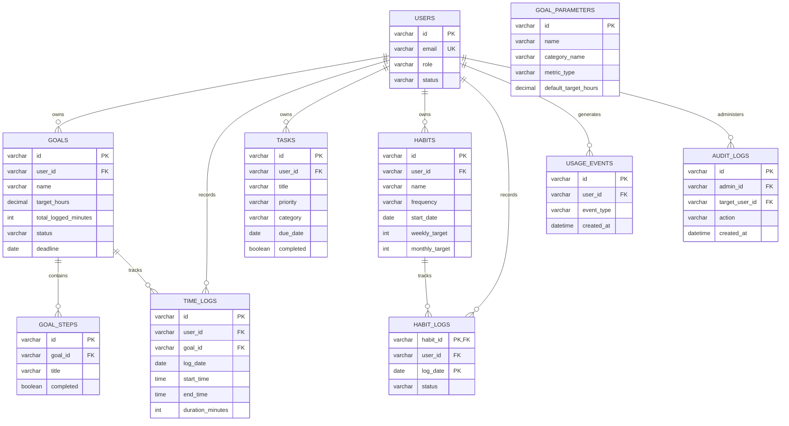

# Database ER diagram

```mermaid
erDiagram
    USERS ||--o{ GOALS : owns
    USERS ||--o{ TIME_LOGS : records
    USERS ||--o{ TASKS : owns
    USERS ||--o{ HABITS : owns
    USERS ||--o{ HABIT_LOGS : records
    GOALS ||--o{ GOAL_STEPS : contains
    GOALS ||--o{ TIME_LOGS : tracks
    USERS ||--o{ USAGE_EVENTS : generates
    USERS ||--o{ AUDIT_LOGS : administers
    HABITS ||--o{ HABIT_LOGS : tracks

    USERS {
        varchar id PK
        varchar email UK
        varchar role
        varchar status
    }
    GOALS {
        varchar id PK
        varchar user_id FK
        varchar name
        decimal target_hours
        int total_logged_minutes
        varchar status
        date deadline
    }
    GOAL_STEPS {
        varchar id PK
        varchar goal_id FK
        varchar title
        boolean completed
    }
    TIME_LOGS {
        varchar id PK
        varchar user_id FK
        varchar goal_id FK
        date log_date
        time start_time
        time end_time
        int duration_minutes
    }
    TASKS {
        varchar id PK
        varchar user_id FK
        varchar title
        varchar priority
        varchar category
        date due_date
        boolean completed
    }
    HABITS {
        varchar id PK
        varchar user_id FK
        varchar name
        varchar frequency
        date start_date
        int weekly_target
        int monthly_target
    }
    HABIT_LOGS {
        varchar habit_id PK, FK
        varchar user_id FK
        date log_date PK
        varchar status
    }
    GOAL_PARAMETERS {
        varchar id PK
        varchar name
        varchar category_name
        varchar metric_type
        decimal default_target_hours
    }
    USAGE_EVENTS {
        varchar id PK
        varchar user_id FK
        varchar event_type
        datetime created_at
    }
    AUDIT_LOGS {
        varchar id PK
        varchar admin_id FK
        varchar target_user_id FK
        varchar action
        datetime created_at
    }
```

The authoritative column definitions and constraints are in [`backend/src/main/resources/db/schema.sql`](../backend/src/main/resources/db/schema.sql).

