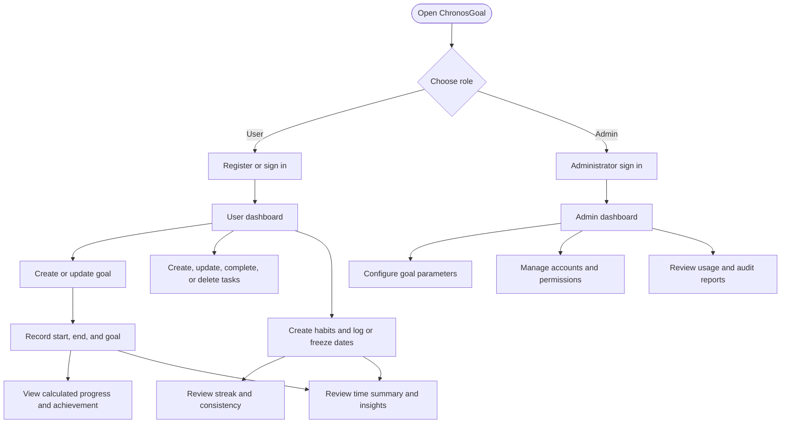

# User and administrator workflows

Protected operations use the authenticated session; users can access only their own goals, goal steps, time logs, tasks, and habits. Habit completion history is stored per date, and insights summarize time logs and habit logs without changing their source data.

